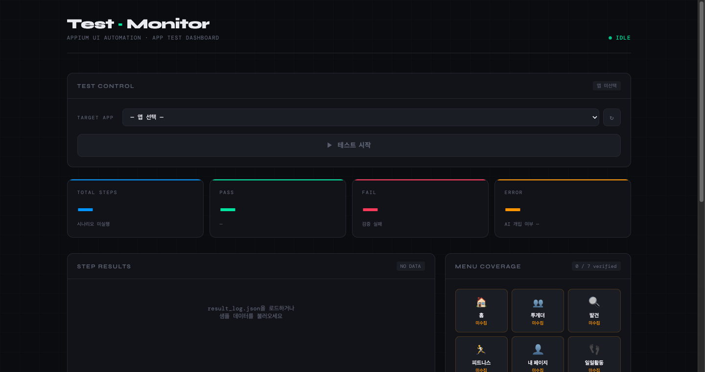
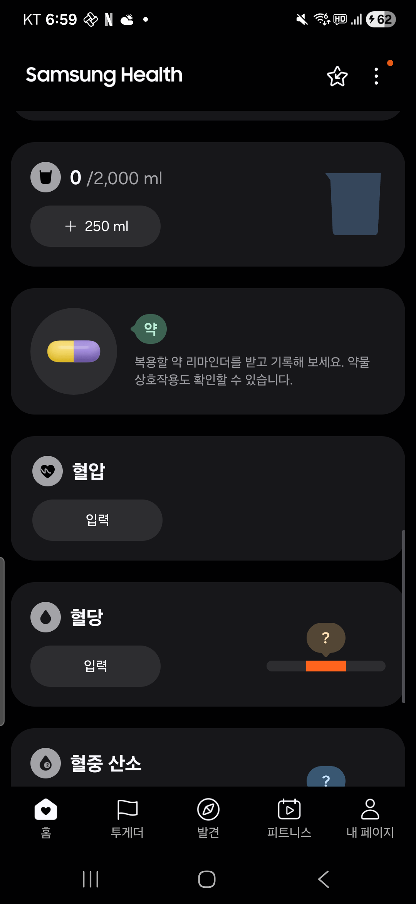

# Device Test — Appium Android UI 자동화

Android 앱을 대상으로 UI 요소를 자동 수집하고, 시나리오 기반 테스트를 실행하며, 결과를 웹 대시보드로 실시간 모니터링하는 자동화 프레임워크입니다.

---

## 대시보드 스크린샷



---

## 시스템 구조

```
Device Test
│
├── 📱 Android 단말 (ADB 연결)
│       └── 테스트 대상 앱 (Samsung Health, Calculator …)
│
├── 🔧 Appium Server (http://127.0.0.1:4723)
│       └── UiAutomator2 드라이버 → 앱 조작 / XML dump
│
├── 🗺  UI 맵 수집
│   ├── app_scanner.py     앱 이름 → 패키지 탐색 → XML 수집 → ui_map 저장
│   └── ui_maps/
│       ├── com.sec.android.app.shealth.json
│       └── com.sec.android.app.popupcalculator.json
│
├── 🏃 테스트 실행
│   ├── run_app.py         ui_map 기반 범용 시나리오 러너
│   └── result_log.json    실행 결과 (자동 생성)
│
└── 🌐 웹 대시보드
    ├── server.py          Flask 서버 (SSE 실시간 스트림)
    └── dashboard.html     테스트 컨트롤 + 결과 시각화
```

### 데이터 흐름

```
앱 이름 입력
    │
    ▼
app_scanner.py
  ├─ adb pm list packages → 패키지명 탐색
  ├─ Appium XML dump (스크롤 스캔)
  ├─ Inspector XML 병합 (inspector_dumps/)
  └─ ui_maps/<package>.json 저장
         │
         ▼
  웹 대시보드 (server.py + dashboard.html)
  ├─ 앱 / 시나리오 선택
  ├─ 테스트 시작 버튼 → run_app.py 실행
  ├─ SSE 실시간 로그 스트림
  └─ 완료 시 결과 자동 렌더
         │
         ▼
  run_app.py
  ├─ 앱 강제 종료 → 재실행 (terminate + activate)
  ├─ 단계별 액션: launch / wait / click / scroll_click / verify_screen
  ├─ 오류 시 스크린샷 자동 저장
  └─ result_log.json 저장
```

---

## 파일 구성

| 파일 | 역할 |
|------|------|
| `app_scanner.py` | 앱 이름으로 패키지 탐색 + XML 수집 + ui_map 생성 |
| `run_app.py` | ui_map 기반 범용 시나리오 실행기 |
| `server.py` | Flask 웹 서버 (REST API + SSE) |
| `dashboard.html` | 테스트 대시보드 UI |
| `ui_maps/` | 앱별 UI 맵 JSON |
| `inspector_dumps/` | Appium Inspector 내보내기 XML |
| `poc_learn.py` | 계산기 PoC — UI 학습 |
| `poc_run.py` | 계산기 PoC — 시나리오 실행 |

---

## 빠른 시작

### 1. 사전 요구사항

```bash
pip install Appium-Python-Client selenium flask
# Appium 서버 실행
appium
# Android 단말 ADB 연결 확인
adb devices
```

### 2. UI 맵 수집

```bash
python app_scanner.py "삼성헬스"
# → ui_maps/com.sec.android.app.shealth.json 생성
```

### 3. 웹 대시보드 실행

```bash
python server.py
# → http://localhost:5000 접속
```

브라우저에서 앱 선택 → 시나리오 선택 → **테스트 시작** 클릭

### 4. CLI 직접 실행

```bash
python run_app.py com.sec.android.app.shealth all
python run_app.py com.sec.android.app.shealth blood_oxygen_tap_check
```

---

## 지원 액션

| 액션 | 설명 |
|------|------|
| `launch` | 앱 강제 종료 후 재실행 |
| `wait` | 지정 시간(ms) 대기 |
| `click` | element 탐색 후 클릭 (resource_id → xpath → content_desc → bounds 순) |
| `scroll_click` | UIScrollable 스크롤 후 탭 |
| `verify_screen` | 크래시 다이얼로그 감지 |

---

## 결과 형식

```json
{
  "scenario_id": "blood_oxygen_tap_check",
  "result": "PASS",
  "ai_invoked": false,
  "summary": { "total": 7, "pass": 7, "fail": 0, "error": 0 },
  "elapsed_seconds": 18,
  "steps": [...]
}
```

| result | 의미 |
|--------|------|
| `PASS` | 전체 시나리오 성공 |
| `FAIL` | 화면 검증 실패 |
| `ERROR` | element 미탐색 → 스크린샷 저장 |

---

## 장치 스크린샷 (Samsung Health)


